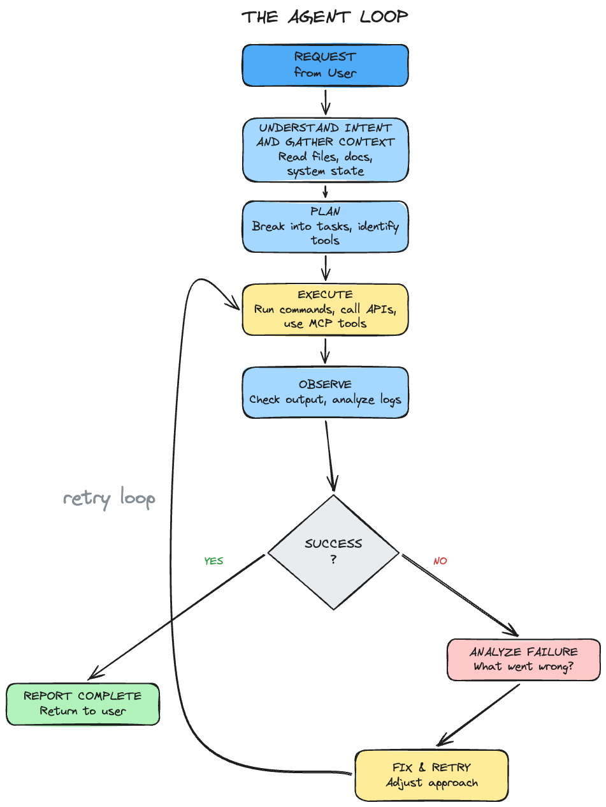
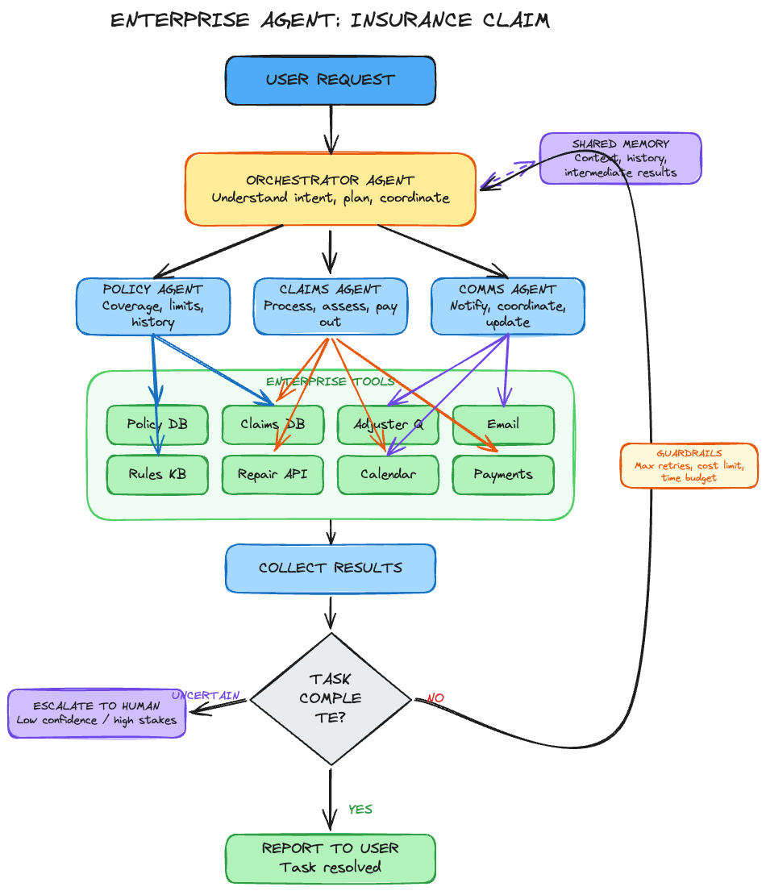

# Agent Loops: The Reason AI Gets Things Done

I asked Claude Code to refactor a module that had grown too large. It read every file in the directory first. Then it planned a sequence of extractions, identified which functions depended on which, and started moving code. Halfway through, a test broke. It read the test output, traced the failure back to a missing import, fixed it, re-ran the tests, and kept going. I did not intervene once.

That is an agent loop in action. And it is becoming one of the most important architectural patterns in modern AI.

## What Changed

The pattern itself is straightforward. Execute an action. Check the output. Analyze whether something went wrong or completed successfully. If there is an error, figure out what needs to be fixed. Try again. Instead of asking the user to paste the result of a suggested action, the agent just does it.

Feedback loops have existed for decades. Systems in robotics and reinforcement learning have long used sense, plan, act. What is new is placing an LLM inside that loop. The model can reason about failures, adapt its strategy, and try again without requiring a human in the middle.

## The Agent Loop

The key difference from traditional prompt-based systems is that reasoning happens repeatedly inside this loop. The model is not producing a single answer. It continuously evaluates progress toward the goal and adapts its plan based on real-world feedback.

Understand context. Plan. Execute. Observe. Adapt. Each task, if required, gets delegated to sub-agents. Tools available through APIs or MCP servers get invoked as necessary. The agent keeps checking back to see if its work aligns with the original request.

**This is not magic. It is a loop. But it is a relentless one.**

## The Enterprise Opportunity

Several applications are already using agentic approaches effectively. Claude Code and Codex have shown what happens when you get agent loops right for coding. Reading code, planning changes, executing, running tests, and fixing failures autonomously. The feedback loop is tight because code gives you clear signals: it compiles or it does not, tests pass or they fail.

Now imagine applying that same pattern to other enterprise workflows where the signals are different but the loop is the same.

Take insurance claims. Today, you file a claim after a car accident. You upload photos to one portal, call to check your coverage, wait for an adjuster, get a repair estimate separately, follow up on the payout. Weeks pass. Multiple systems, multiple people, no one connecting the dots.

With an agent loop, you file the claim once. The system pulls your policy details, verifies coverage limits, requests the police report and photos, routes to an adjuster, coordinates with a repair shop for estimates, schedules a rental car, calculates the payout, and initiates payment. Multiple agents working across multiple systems, looping until the claim is fully resolved.

The difference is not smarter answers. It is the ability to act.

An agent that understands intent, is context-aware of the entire enterprise, has access to the right tools, and does not just answer but acts. Then comes back to tell you the task is complete. The diagram also shows what production systems need: shared memory across agents, guardrails on retries and cost, and the ability to escalate to a human when confidence is low.

## Realistic Constraints

These systems are powerful, but they are not perfect.

Agent loops can get stuck in repeated attempts, burn through tokens on dead-end strategies, or misunderstand the goal entirely. The harder failure mode is when the agent completes successfully but did the wrong thing. Confidence without correctness is a real risk.

In production, engineers add limits on iterations, execution time, and cost budgets. Equally important is knowing when to pull a human back into the loop. Full autonomy is not always the right answer. The best systems are designed to escalate when confidence is low or when the stakes are high.

So how do you build systems that are both autonomous and trustworthy?

## What Comes Next

When you build systems like this, they need to get better over time. That gives confidence to the people building and leading them. A large class of repetitive computer tasks that previously required a person sitting in front of a screen becomes automatable.

We spent years training models. Now we are training workflows. **The model is the engine. The loop is what makes it drive.**

The primitives are here. The models are capable. The tooling ecosystem through MCP and function calling has matured. Frameworks for building and orchestrating agent loops are production-ready. It is time to build.

The companies that figure out how to deploy agent loops at enterprise scale will unlock something significant. Not just answering questions. Not just suggesting actions. But autonomously executing complex workflows while staying within guardrails.

There is a phrase every driver knows: **objects in the mirror are closer than they appear.** Understanding that made me more aware on the road. I keep coming back to it now for a different reason. The future of autonomous AI workflows is closer than most people think.

The question is not whether it will happen. **It is whether you are ready to build them?**
