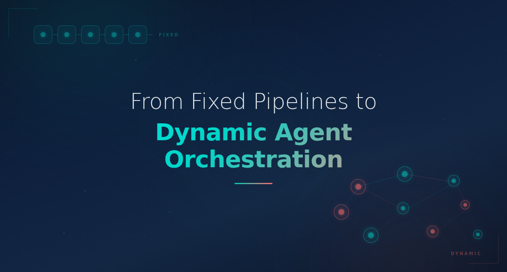
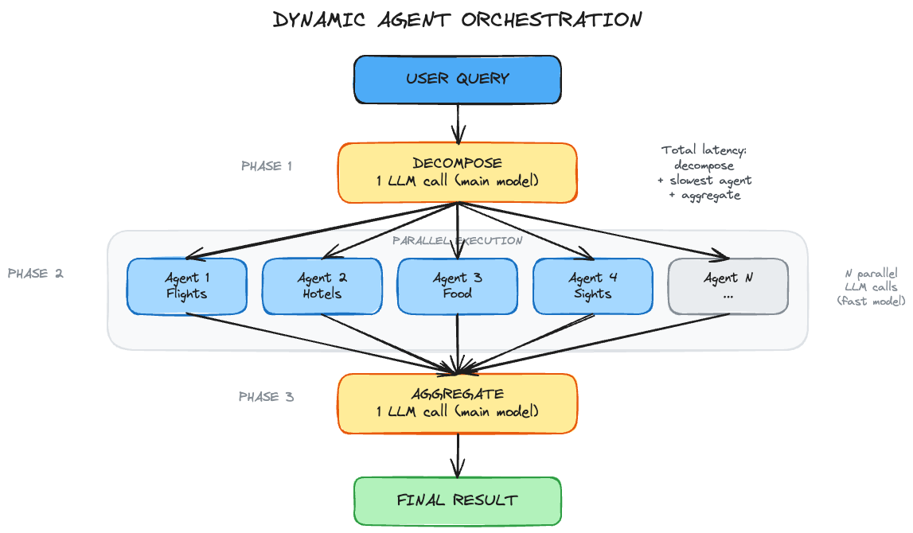

# Let the Model Decide: From Fixed Pipelines to Dynamic Agent Orchestration



A few months ago, I built a travel planner the obvious way. One agent for flights. One for hotels. One for restaurants. One for attractions. Four agents, hardcoded, running on every single query.

One of the queries was "What's the weather in Bali next week?" and the system dutifully searched for flights, found hotels, recommended restaurants, and listed tourist spots. For a weather question. It took 15 seconds and cost me tokens I did not need to spend.

Then another query came in about a two-week trip to Japan with elderly parents, wheelchair accessibility, vegetarian restaurants, and a rail pass. The same four agents tried to cover all of that. No one was researching accessibility. No one was looking into rail passes. The output had gaps you could drive through.

That is when I started rethinking the fixed pipeline. Instead of deciding upfront what agents to run, I let the model figure it out.


## From Fixed to Dynamic

In dynamic orchestration, there is no fixed set of agents. There is one orchestrator that reads the user's query, decides what research tasks are actually needed, and spins them up on the fly. A weekend beach trip gets 4 tasks. A complex international family vacation gets 10. The system matches its effort to the problem.

Here is the prompt that makes this work:

```
You are an intelligent travel planning orchestrator.
Given a user's travel query, you must analyze it and break it down
into independent research tasks that can be executed IN PARALLEL
by separate agents.

IMPORTANT RULES:
1. Only create tasks that are ACTUALLY needed based on the query
2. Each task must be INDEPENDENT (can run without results from other tasks)
3. Be smart about what tasks to create - a weekend trip needs fewer
   tasks than a 2-week international trip
4. Each task's prompt must be self-contained with all context needed
```

That prompt defines the planning logic of the architecture. Not a class hierarchy. Not an interface. A paragraph of English that tells the model how to think about decomposition.

For "Plan a 3-day trip to Barcelona for a couple who loves food and architecture," the model comes back with:

```json
{
  "analysis": "Couple's trip focused on culinary and architectural experiences",
  "tasks": [
    {"id": "task_1", "name": "Flight Research", "category": "flights"},
    {"id": "task_2", "name": "Boutique Hotel Finder", "category": "hotels"},
    {"id": "task_3", "name": "Restaurant & Food Tour Research", "category": "restaurants"},
    {"id": "task_4", "name": "Gaudi & Architecture Guide", "category": "attractions"},
    {"id": "task_5", "name": "Weather & Packing", "category": "weather"}
  ]
}
```

Five tasks. Each one tailored to what this query actually needs. Change the query to "Weekend trip to Barcelona, just need a hotel" and you get two tasks. The system scales with the question.


## Every Task Must Stand Alone

The rule that makes parallelism possible: no task can depend on another task's output. If the hotel agent needs flight arrival times, you cannot run them at the same time. So the decomposition prompt forces every task to be self-contained, with all the context it needs baked into its own prompt.

In practice, full independence is hard to achieve. Hotel choice depends on neighborhood. Dining depends on location. The workaround is to embed shared context into every task. Destination, dates, preferences, budget. Every agent gets the full picture, even if it only uses part of it.

For more complex domains, you might need staged execution. A first wave of independent tasks, then a second wave that builds on those results. The patterns work together.


## Running Everything at Once

Once the tasks are set, execution is the easy part.

```python
async def _run_agents_parallel(self, tasks: list[dict]) -> list[dict]:
    async def _run_single(task):
        start = time.time()
        result = await self.orchestrator.run_agent(task)
        result["execution_time_ms"] = round((time.time() - start) * 1000)
        return result

    results = await asyncio.gather(*[_run_single(t) for t in tasks])
    return list(results)
```

`asyncio.gather` fires all tasks at the same time and waits for them to finish. That is the whole engine.

We can track timing on both sides:

```python
sequential_time_ms = sum(r["execution_time_ms"] for r in agent_results)
parallel_time_ms = round(parallel_time * 1000)
speedup_factor = round(sequential_time_ms / max(parallel_time_ms, 1), 2)
```

With 6 agents each taking 2-4 seconds, parallel execution finishes in about 4 seconds. Running them one at a time would take 15-20. That is a 4-5x improvement under good conditions.

The real number will be lower. API rate limits throttle concurrent requests. Providers cap how many calls you can make at once. The token cost is the same whether you run agents in parallel or sequentially. But parallel execution dramatically cuts the time your user is waiting. That is the real win.

One decision that keeps cost in check: use a powerful model for decomposition and aggregation, a fast cheap model for the individual agents. The orchestrator needs to think carefully about what tasks to create. The agents just need to research a topic and return structured data. I use GPT-4o or Claude Sonnet for the orchestrator, GPT-4o-mini or Claude Haiku for the agents. The per-agent cost stays low even when the count goes up.


## Putting It Back Together

Independent agents produce independent results. The aggregator stitches them into something coherent.

```
You are a travel itinerary aggregator. You receive research results
from multiple parallel agents and must combine them into a coherent,
day-by-day travel itinerary.

Create a well-organized itinerary that:
1. Arranges activities logically by day and geography
2. Includes practical details (costs, timings, tips)
3. Highlights the best recommendations from each research area
```

This is harder than it sounds. Agents return conflicting recommendations. One suggests a restaurant downtown while another plans your evening at the beach. Assumptions about dates do not always line up. The aggregator is doing synthesis, not concatenation. And it can get it wrong. It has to make judgment calls, and sometimes it makes bad ones. It took a few bad itineraries before I realized the aggregation prompt needs as much care as the decomposition prompt.

The full flow looks like this:



Total wait time: decompose + slowest agent + aggregate. Not decompose + every agent added together. With 8 agents averaging 3 seconds each, that is the difference between 10 seconds and 30 seconds.


## The Prompt Is the Architecture (But Not All of It)

The decomposition prompt is what makes this a travel planner. Swap it out and the same Python code becomes a research assistant, a competitive analysis tool, or a document review system. **The code is plumbing. The prompt is the blueprint.**

But the prompt only handles the happy path. Reliability lives in code. JSON schema validation. Retry logic. Timeout handling. Cost guardrails. Handling garbage agent responses. Catching hallucinated task categories.

**The prompt decides what to do. The code decides what to do when things go wrong.** In production, the second part matters more.

A one-line prompt change can completely alter what agents get spawned. I treat prompt changes with the same rigor as code changes. Version control, review, testing against a set of representative queries.


## Where This Works and Where It Does Not

This pattern fits when:

- Query complexity varies widely, where some queries need 3 tasks and others need 12.
- The tasks are naturally independent.
- Users are waiting for a response.

It does not fit everywhere:

- **Tasks have dependencies.** If one agent needs another's output before it can start, you cannot parallelize them. You need a different pattern.
- **Quality requires iteration.** If agents need to review and refine each other's work, a single parallel pass wont be enough.
- **Your domain is narrow.** If every query needs the exact same three steps, just hardcode three agents. The overhead of dynamic decomposition is not worth it for a problem that does not change shape.
- **You need depth over breadth.** More agents cover more ground, but each one gets a single pass. No iteration, no "go deeper on this." A hotel agent that searches, reads reviews, checks availability, and refines its pick through several rounds will beat one that returns its first result. Fan-out trades depth for breadth and speed. That is the right trade for travel planning. It is the wrong trade for medical diagnosis or financial modeling.


## The Fragile Part

Everything in this system depends on one LLM call: the decomposition.

If that call produces overlapping tasks, the agents waste time on duplicate work. If it misses something obvious, no downstream agent can fill the gap. If it goes overboard, you burn tokens on agents that add nothing.

I have seen all three. The decomposer created both "Restaurant Research" and "Food & Dining Guide" for the same query. It skipped visa research for an international trip. It spawned 12 agents for a question that needed 3.

For a production system, I would add four things:

1. **A validation step before execution.** Check the plan for coverage and redundancy. This can be a second LLM call or a rule-based check. Catch bad decompositions before they multiply.
2. **A task count ceiling.** Without a cap, a vague query like "plan the perfect vacation" can go wild. Set a maximum, maybe 8 or 10, and force the decomposer to prioritize.
3. **Partial failure handling.** If one agent out of eight fails, you should still get the other seven results. Use `asyncio.gather(*tasks, return_exceptions=True)` and let the aggregator work with what it has.
4. **Quality tracking over time.** There is no single "correct" decomposition for a given query, which makes evaluation tricky. You cannot just diff against an expected output. So track what you can: task coverage, task redundancy, downstream user satisfaction. Build an evaluation set of representative queries and run it against prompt changes before you deploy them. Without this, you are flying blind on the most critical part of the system.


## What Comes Next

This is not a replacement for static pipelines. Plenty of systems do fine with fixed orchestration, and they should keep doing that.

But the interesting direction is what happens when you push this pattern further. Staged decomposition, where the second wave of agents builds on the first wave's results. Agents that can request more agents mid-execution. Decomposition that learns from past queries and improves over time without prompt changes.

The tooling landscape is moving quickly. Agent tracing and observability platforms already exist. But decomposition quality, knowing whether the plan itself was good, is still something we need to actively measure and improve. That is where our focus should be.

**The question is not how many agents you need. It is whether the problem changes shape from query to query. If it does, stop hardcoding the answer. Let the model decide.**

## Try It Yourself

- **Live App:** [narasimha-badrinath.com/multiagent-travelplanner](https://narasimha-badrinath.com/multiagent-travelplanner/)
- **Source Code:** [github.com/bnarasimha21/multiagent-travelplanner](https://github.com/bnarasimha21/multiagent-travelplanner)
